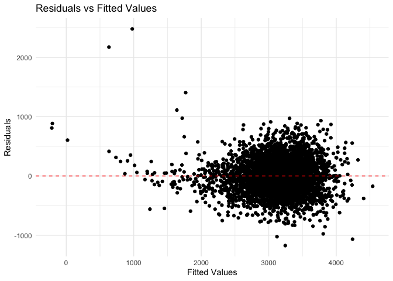

Homework6
================
Yunjia Liu
2024-12-02

## Probelm 1

1.  Load the dataset.

``` r
weather_df = 
  rnoaa::meteo_pull_monitors(
    c("USW00094728"),
    var = c("PRCP", "TMIN", "TMAX"), 
    date_min = "2017-01-01",
    date_max = "2017-12-31") |>
  mutate(
    name = recode(id, USW00094728 = "CentralPark_NY"),
    tmin = tmin / 10,
    tmax = tmax / 10) |>
  select(name, id, everything())
```

    ## using cached file: /Users/veronica/Library/Caches/org.R-project.R/R/rnoaa/noaa_ghcnd/USW00094728.dly

    ## date created (size, mb): 2024-09-26 10:17:42.269536 (8.651)

    ## file min/max dates: 1869-01-01 / 2024-09-30

2.  A function to calculate the r-squared and log(beta0 \* beta1)  
    First, establish a linear model between t_max and t_min. Then, we
    calculate the desired coefficient.

``` r
compute_stats = function(data) {
  model = lm(tmax ~ tmin, data = data)
  glance_model = broom::glance(model)
  tidy_model = broom::tidy(model)
  
  r_squared = glance_model$r.squared
  
  beta0 = tidy_model$estimate[tidy_model$term == "(Intercept)"]
  beta1 = tidy_model$estimate[tidy_model$term == "tmin"]
  
  log_beta0_beta1 = log(abs(beta0 * beta1))
  return(tibble(r_squared = r_squared, log_beta0_beta1 = log_beta0_beta1))
}
```

3.  A quick function to generate our bootstrap samples

``` r
boot_sample = function(df) {
  sample_frac(df, replace = TRUE)
}
```

4.  Perform bootstrap and compute r^2 and log(beta0 \* beta1)

``` r
n_boot = 5000
set.seed(123)

boot_straps =
  tibble(strap_number = 1:n_boot) |>
  mutate(
    strap_sample = map(strap_number, ~ boot_sample(weather_df)),  
    stats = map(strap_sample, compute_stats)
  )
```

5.  Extract results into a tidy format.

``` r
boot_results = 
  boot_straps |>
  unnest_wider(stats)
```

6.  Calculate the 95% confidence intervals for r^2 and log(beta0 \*
    beta1).

``` r
ci_r_squared = quantile(boot_results$r_squared, c(0.025, 0.975))
ci_log_beta0_beta1 = quantile(boot_results$log_beta0_beta1, c(0.025, 0.975))

cat("95% CI for r^2: ", ci_r_squared, "\n")
```

    ## 95% CI for r^2:  0.8945701 0.9271042

``` r
cat("95% CI for log(beta0 * beta1): ", ci_log_beta0_beta1, "\n")
```

    ## 95% CI for log(beta0 * beta1):  1.964166 2.058364

7.  Plot distributions of two estimates (r^2 and log(beta0 \* beta1))

``` r
ggplot(boot_results, aes(x = r_squared)) +
  geom_histogram(binwidth = 0.01, color = "black", fill = "blue", alpha = 0.7) +
  labs(title = "Bootstrap Distribution of r^2", x = "r^2", y = "Frequency") +
  theme(
    plot.title = element_text(hjust = 0.5)
  )
```

<!-- -->

``` r
ggplot(boot_results, aes(x = log_beta0_beta1)) +
  geom_histogram(binwidth = 0.05, color = "black", fill = "red", alpha = 0.7) +
  labs(title = "Bootstrap Distribution of log(beta0 * beta1)", x = "log(beta0 * beta1)", y = "Frequency") +
  theme(
    plot.title = element_text(hjust = 0.5)
  )
```

<!-- -->

## Problem 2

1.  Load the dataset and mutate the variables according to the
    requirement.  

    Create a city_state variable and a binary variable indicating
    whether the homicide is solved. Omit cities Dallas, TX; Phoenix, AZ;
    and Kansas City, MO and Tulsa, AL. filter the **victim_race** to
    limit analysis for whom victim_race is white or black. Take
    ‘Unknown’ as na and convert the **victim_age**.

``` r
homocide_data = read_csv("./data/homicide-data.csv",,na = c("", "NA", "N/A","Unknown"))
```

    ## Rows: 52179 Columns: 12
    ## ── Column specification ────────────────────────────────────────────────────────
    ## Delimiter: ","
    ## chr (8): uid, victim_last, victim_first, victim_race, victim_sex, city, stat...
    ## dbl (4): reported_date, victim_age, lat, lon
    ## 
    ## ℹ Use `spec()` to retrieve the full column specification for this data.
    ## ℹ Specify the column types or set `show_col_types = FALSE` to quiet this message.

``` r
homocide_data =
  homocide_data |>
  janitor::clean_names() |>
  mutate(
    city_state = paste(city, state, sep = ", "),
    solved = ifelse(disposition == "Closed by arrest", 1, 0),
    victim_age = as.numeric(victim_age)
  ) |>
  filter(
    !(city_state %in% c("Dallas, TX", "Phoenix, AZ", "Kansas City, MO", "Tulsa, AL")),
    victim_race %in% c("White", "Black"),
    !is.na(victim_age)
  )
```

2.  Logistic Regression for Baltimore, MD  

use the `glm` function to fit a logistic regression with resolved vs
unresolved as the outcome and victim age, sex and race as predictors.

``` r
baltimore_data =
  homocide_data |>
  filter(city_state == "Baltimore, MD")

baltimore_model = glm(
  solved ~ victim_age + victim_sex + victim_race,
  data = baltimore_data
)

saveRDS(baltimore_model, file = "model/baltimore_glm_model.rds")
```

3.  For Baltimore,MD: obtain the estimate and confidence interval of the
    adjusted odds ratio for solving homicides comparing male victims to
    female victims keeping all other variables fixed.

``` r
baltimore_loaded_model = readRDS("model/baltimore_glm_model.rds")

baltimore_or = 
  broom::tidy(baltimore_loaded_model) |>
  filter(term == "victim_sexMale") |>
  mutate(
    OR = exp(estimate),
    CI_lower = exp(estimate - 1.96 * std.error),
    CI_upper = exp(estimate + 1.96 * std.error)
  )

baltimore_or |>
  knitr::kable(digits = 3)
```

| term           | estimate | std.error | statistic | p.value |    OR | CI_lower | CI_upper |
|:---------------|---------:|----------:|----------:|--------:|------:|---------:|---------:|
| victim_sexMale |   -0.204 |     0.032 |     -6.38 |       0 | 0.816 |    0.766 |    0.868 |

4.  Logistic Regression for All Cities.  

run `glm` for each of the cities in dataset, and extract the adjusted
odds ratio (and CI) for solving homicides comparing male victims to
female victims.

``` r
city_models =
  homocide_data |> 
  group_by(city_state) |> 
  nest() |> 
  mutate(
    model = map(data, ~ glm(solved ~ victim_age + victim_sex + victim_race, data = ., family = binomial())),
    results = map(model, ~ broom::tidy(.) |> 
                    filter(term == "victim_sexMale") |> 
                    mutate(
                      OR = exp(estimate),
                      CI_lower = exp(estimate - 1.96 * std.error),
                      CI_upper = exp(estimate + 1.96 * std.error)
                    ))
  ) |> 
  unnest(results) |> 
  select(city_state, term, OR, CI_lower, CI_upper, p.value)

city_models |> 
  knitr::kable(digits = 3)
```

| city_state         | term           |    OR | CI_lower | CI_upper | p.value |
|:-------------------|:---------------|------:|---------:|---------:|--------:|
| Albuquerque, NM    | victim_sexMale | 1.767 |    0.831 |    3.761 |   0.139 |
| Atlanta, GA        | victim_sexMale | 1.000 |    0.684 |    1.463 |   1.000 |
| Baltimore, MD      | victim_sexMale | 0.426 |    0.325 |    0.558 |   0.000 |
| Baton Rouge, LA    | victim_sexMale | 0.381 |    0.209 |    0.695 |   0.002 |
| Birmingham, AL     | victim_sexMale | 0.870 |    0.574 |    1.318 |   0.511 |
| Boston, MA         | victim_sexMale | 0.667 |    0.354 |    1.260 |   0.212 |
| Buffalo, NY        | victim_sexMale | 0.521 |    0.290 |    0.935 |   0.029 |
| Charlotte, NC      | victim_sexMale | 0.884 |    0.557 |    1.403 |   0.600 |
| Chicago, IL        | victim_sexMale | 0.410 |    0.336 |    0.501 |   0.000 |
| Cincinnati, OH     | victim_sexMale | 0.400 |    0.236 |    0.677 |   0.001 |
| Columbus, OH       | victim_sexMale | 0.532 |    0.378 |    0.750 |   0.000 |
| Denver, CO         | victim_sexMale | 0.479 |    0.236 |    0.971 |   0.041 |
| Detroit, MI        | victim_sexMale | 0.582 |    0.462 |    0.734 |   0.000 |
| Durham, NC         | victim_sexMale | 0.812 |    0.392 |    1.683 |   0.576 |
| Fort Worth, TX     | victim_sexMale | 0.669 |    0.397 |    1.127 |   0.131 |
| Fresno, CA         | victim_sexMale | 1.335 |    0.580 |    3.071 |   0.496 |
| Houston, TX        | victim_sexMale | 0.711 |    0.558 |    0.907 |   0.006 |
| Indianapolis, IN   | victim_sexMale | 0.919 |    0.679 |    1.242 |   0.582 |
| Jacksonville, FL   | victim_sexMale | 0.720 |    0.537 |    0.966 |   0.028 |
| Las Vegas, NV      | victim_sexMale | 0.837 |    0.608 |    1.154 |   0.278 |
| Long Beach, CA     | victim_sexMale | 0.410 |    0.156 |    1.082 |   0.072 |
| Los Angeles, CA    | victim_sexMale | 0.662 |    0.458 |    0.956 |   0.028 |
| Louisville, KY     | victim_sexMale | 0.491 |    0.305 |    0.790 |   0.003 |
| Memphis, TN        | victim_sexMale | 0.723 |    0.529 |    0.988 |   0.042 |
| Miami, FL          | victim_sexMale | 0.515 |    0.304 |    0.872 |   0.013 |
| Milwaukee, wI      | victim_sexMale | 0.727 |    0.499 |    1.060 |   0.098 |
| Minneapolis, MN    | victim_sexMale | 0.947 |    0.478 |    1.875 |   0.876 |
| Nashville, TN      | victim_sexMale | 1.034 |    0.685 |    1.562 |   0.873 |
| New Orleans, LA    | victim_sexMale | 0.585 |    0.422 |    0.811 |   0.001 |
| New York, NY       | victim_sexMale | 0.262 |    0.138 |    0.499 |   0.000 |
| Oakland, CA        | victim_sexMale | 0.563 |    0.365 |    0.868 |   0.009 |
| Oklahoma City, OK  | victim_sexMale | 0.974 |    0.624 |    1.520 |   0.908 |
| Omaha, NE          | victim_sexMale | 0.382 |    0.203 |    0.721 |   0.003 |
| Philadelphia, PA   | victim_sexMale | 0.496 |    0.378 |    0.652 |   0.000 |
| Pittsburgh, PA     | victim_sexMale | 0.431 |    0.265 |    0.700 |   0.001 |
| Richmond, VA       | victim_sexMale | 1.006 |    0.498 |    2.033 |   0.987 |
| San Antonio, TX    | victim_sexMale | 0.705 |    0.398 |    1.249 |   0.230 |
| Sacramento, CA     | victim_sexMale | 0.669 |    0.335 |    1.337 |   0.255 |
| Savannah, GA       | victim_sexMale | 0.867 |    0.422 |    1.780 |   0.697 |
| San Bernardino, CA | victim_sexMale | 0.500 |    0.171 |    1.462 |   0.206 |
| San Diego, CA      | victim_sexMale | 0.413 |    0.200 |    0.855 |   0.017 |
| San Francisco, CA  | victim_sexMale | 0.608 |    0.317 |    1.165 |   0.134 |
| St. Louis, MO      | victim_sexMale | 0.703 |    0.530 |    0.932 |   0.014 |
| Stockton, CA       | victim_sexMale | 1.352 |    0.621 |    2.942 |   0.447 |
| Tampa, FL          | victim_sexMale | 0.808 |    0.348 |    1.876 |   0.619 |
| Tulsa, OK          | victim_sexMale | 0.976 |    0.614 |    1.552 |   0.917 |
| Washington, DC     | victim_sexMale | 0.691 |    0.469 |    1.018 |   0.062 |

5.  Visualize the results by plotting the ORs and confidence intervals
    for each city and organize cities according to estimated OR.

``` r
city_models |>
  mutate(city_state = fct_reorder(city_state, OR)) |>
  ggplot(aes(x = city_state, y = OR)) +
  geom_point() +
  geom_errorbar(aes(ymin = CI_lower, ymax = CI_upper), width = 0.2) +
  coord_flip() +
  labs(
    title = "Adjusted Odds Ratios for Solving Homicides by City",
    x = "City",
    y = "Adjusted Odds Ratio (Male vs. Female Victims)"
  ) +
  theme_minimal() +
  theme(
    plot.title = element_text(hjust = 0.5)
  )
```

<!-- -->

- The adjusted odds ratios (ORs) for solving homicides comparing male
  victims to female victims vary widely across cities, indicating
  differences in how male and female homicide cases are resolved
  depending on the location. Cities like Albuquerque, NM, Stockton, CA,
  and Fresno, CA show ORs greater than 2, suggesting that male victim
  cases are much more likely to be solved compared to female victim
  cases in these locations. Some cities, such as Baton Rouge, LA, and
  New York, NY, have ORs below 1, implying that female victim cases are
  more likely to be solved compared to male victim cases in these
  locations.
- Certain cities (e.g., Albuquerque, NM) have wide confidence intervals,
  suggesting a high degree of uncertainty in the OR estimates due to
  variability or limited data. These results should be interpreted
  cautiously.

## Problem 3

``` r
birthweight_data = read_csv("./data/birthweight.csv")
```

    ## Rows: 4342 Columns: 20
    ## ── Column specification ────────────────────────────────────────────────────────
    ## Delimiter: ","
    ## dbl (20): babysex, bhead, blength, bwt, delwt, fincome, frace, gaweeks, malf...
    ## 
    ## ℹ Use `spec()` to retrieve the full column specification for this data.
    ## ℹ Specify the column types or set `show_col_types = FALSE` to quiet this message.

``` r
# Convert categorical variables to factors
birthweight_data = birthweight_data |>
  mutate(
    babysex = factor(babysex, levels = c(1, 2), labels = c("Male", "Female")),
    malform = factor(malform, levels = c(0, 1), labels = c("Absent", "Present")),
    frace = factor(frace),
    mrace = factor(mrace)
  )

summary(birthweight_data)
```

    ##    babysex         bhead          blength           bwt           delwt      
    ##  Male  :2230   Min.   :21.00   Min.   :20.00   Min.   : 595   Min.   : 86.0  
    ##  Female:2112   1st Qu.:33.00   1st Qu.:48.00   1st Qu.:2807   1st Qu.:131.0  
    ##                Median :34.00   Median :50.00   Median :3132   Median :143.0  
    ##                Mean   :33.65   Mean   :49.75   Mean   :3114   Mean   :145.6  
    ##                3rd Qu.:35.00   3rd Qu.:51.00   3rd Qu.:3459   3rd Qu.:157.0  
    ##                Max.   :41.00   Max.   :63.00   Max.   :4791   Max.   :334.0  
    ##     fincome      frace       gaweeks         malform        menarche    
    ##  Min.   : 0.00   1:2123   Min.   :17.70   Absent :4327   Min.   : 0.00  
    ##  1st Qu.:25.00   2:1911   1st Qu.:38.30   Present:  15   1st Qu.:12.00  
    ##  Median :35.00   3:  46   Median :39.90                  Median :12.00  
    ##  Mean   :44.11   4: 248   Mean   :39.43                  Mean   :12.51  
    ##  3rd Qu.:65.00   8:  14   3rd Qu.:41.10                  3rd Qu.:13.00  
    ##  Max.   :96.00            Max.   :51.30                  Max.   :19.00  
    ##     mheight          momage     mrace        parity            pnumlbw 
    ##  Min.   :48.00   Min.   :12.0   1:2147   Min.   :0.000000   Min.   :0  
    ##  1st Qu.:62.00   1st Qu.:18.0   2:1909   1st Qu.:0.000000   1st Qu.:0  
    ##  Median :63.00   Median :20.0   3:  43   Median :0.000000   Median :0  
    ##  Mean   :63.49   Mean   :20.3   4: 243   Mean   :0.002303   Mean   :0  
    ##  3rd Qu.:65.00   3rd Qu.:22.0            3rd Qu.:0.000000   3rd Qu.:0  
    ##  Max.   :77.00   Max.   :44.0            Max.   :6.000000   Max.   :0  
    ##     pnumsga      ppbmi            ppwt           smoken           wtgain      
    ##  Min.   :0   Min.   :13.07   Min.   : 70.0   Min.   : 0.000   Min.   :-46.00  
    ##  1st Qu.:0   1st Qu.:19.53   1st Qu.:110.0   1st Qu.: 0.000   1st Qu.: 15.00  
    ##  Median :0   Median :21.03   Median :120.0   Median : 0.000   Median : 22.00  
    ##  Mean   :0   Mean   :21.57   Mean   :123.5   Mean   : 4.145   Mean   : 22.08  
    ##  3rd Qu.:0   3rd Qu.:22.91   3rd Qu.:134.0   3rd Qu.: 5.000   3rd Qu.: 28.00  
    ##  Max.   :0   Max.   :46.10   Max.   :287.0   Max.   :60.000   Max.   : 89.00

``` r
# Check for missing data
colSums(is.na(birthweight_data))
```

    ##  babysex    bhead  blength      bwt    delwt  fincome    frace  gaweeks 
    ##        0        0        0        0        0        0        0        0 
    ##  malform menarche  mheight   momage    mrace   parity  pnumlbw  pnumsga 
    ##        0        0        0        0        0        0        0        0 
    ##    ppbmi     ppwt   smoken   wtgain 
    ##        0        0        0        0

``` r
# View structure of the dataset
str(birthweight_data)
```

    ## tibble [4,342 × 20] (S3: tbl_df/tbl/data.frame)
    ##  $ babysex : Factor w/ 2 levels "Male","Female": 2 1 2 1 2 1 2 2 1 1 ...
    ##  $ bhead   : num [1:4342] 34 34 36 34 34 33 33 33 36 33 ...
    ##  $ blength : num [1:4342] 51 48 50 52 52 52 46 49 52 50 ...
    ##  $ bwt     : num [1:4342] 3629 3062 3345 3062 3374 ...
    ##  $ delwt   : num [1:4342] 177 156 148 157 156 129 126 140 146 169 ...
    ##  $ fincome : num [1:4342] 35 65 85 55 5 55 96 5 85 75 ...
    ##  $ frace   : Factor w/ 5 levels "1","2","3","4",..: 1 2 1 1 1 1 2 1 1 2 ...
    ##  $ gaweeks : num [1:4342] 39.9 25.9 39.9 40 41.6 ...
    ##  $ malform : Factor w/ 2 levels "Absent","Present": 1 1 1 1 1 1 1 1 1 1 ...
    ##  $ menarche: num [1:4342] 13 14 12 14 13 12 14 12 11 12 ...
    ##  $ mheight : num [1:4342] 63 65 64 64 66 66 72 62 61 64 ...
    ##  $ momage  : num [1:4342] 36 25 29 18 20 23 29 19 13 19 ...
    ##  $ mrace   : Factor w/ 4 levels "1","2","3","4": 1 2 1 1 1 1 2 1 1 2 ...
    ##  $ parity  : num [1:4342] 3 0 0 0 0 0 0 0 0 0 ...
    ##  $ pnumlbw : num [1:4342] 0 0 0 0 0 0 0 0 0 0 ...
    ##  $ pnumsga : num [1:4342] 0 0 0 0 0 0 0 0 0 0 ...
    ##  $ ppbmi   : num [1:4342] 26.3 21.3 23.6 21.8 21 ...
    ##  $ ppwt    : num [1:4342] 148 128 137 127 130 115 105 119 105 145 ...
    ##  $ smoken  : num [1:4342] 0 0 1 10 1 0 0 0 0 4 ...
    ##  $ wtgain  : num [1:4342] 29 28 11 30 26 14 21 21 41 24 ...

``` r
# Fit the model
birthweight_model = lm(bwt ~ gaweeks + blength + bhead + delwt + momage + smoken, 
                        data = birthweight_data)

# View the summary of the model
summary(birthweight_model)
```

    ## 
    ## Call:
    ## lm(formula = bwt ~ gaweeks + blength + bhead + delwt + momage + 
    ##     smoken, data = birthweight_data)
    ## 
    ## Residuals:
    ##      Min       1Q   Median       3Q      Max 
    ## -1174.69  -185.52    -7.61   176.76  2480.59 
    ## 
    ## Coefficients:
    ##               Estimate Std. Error t value Pr(>|t|)    
    ## (Intercept) -6275.1386    95.7622 -65.528  < 2e-16 ***
    ## gaweeks        14.0343     1.4923   9.405  < 2e-16 ***
    ## blength        78.6566     2.0684  38.027  < 2e-16 ***
    ## bhead         134.3546     3.4942  38.451  < 2e-16 ***
    ## delwt           2.0469     0.1992  10.275  < 2e-16 ***
    ## momage          5.6245     1.1163   5.038 4.88e-07 ***
    ## smoken         -2.4822     0.5824  -4.262 2.07e-05 ***
    ## ---
    ## Signif. codes:  0 '***' 0.001 '**' 0.01 '*' 0.05 '.' 0.1 ' ' 1
    ## 
    ## Residual standard error: 281.5 on 4335 degrees of freedom
    ## Multiple R-squared:  0.6983, Adjusted R-squared:  0.6978 
    ## F-statistic:  1672 on 6 and 4335 DF,  p-value: < 2.2e-16

``` r
# Add predictions and residuals to the dataset
birthweight_data = birthweight_data |>
  add_predictions(birthweight_model) |>
  add_residuals(birthweight_model)

# Plot residuals against fitted values
ggplot(birthweight_data, aes(x = pred, y = resid)) +
  geom_point() +
  geom_hline(yintercept = 0, linetype = "dashed", color = "red") +
  labs(title = "Residuals vs Fitted Values", 
       x = "Fitted Values", 
       y = "Residuals") +
  theme_minimal()
```

<!-- -->

``` r
model1 = lm(bwt ~ blength + gaweeks, data = birthweight_data)
summary(model1)
```

    ## 
    ## Call:
    ## lm(formula = bwt ~ blength + gaweeks, data = birthweight_data)
    ## 
    ## Residuals:
    ##     Min      1Q  Median      3Q     Max 
    ## -1709.6  -215.4   -11.4   208.2  4188.8 
    ## 
    ## Coefficients:
    ##              Estimate Std. Error t value Pr(>|t|)    
    ## (Intercept) -4347.667     97.958  -44.38   <2e-16 ***
    ## blength       128.556      1.990   64.60   <2e-16 ***
    ## gaweeks        27.047      1.718   15.74   <2e-16 ***
    ## ---
    ## Signif. codes:  0 '***' 0.001 '**' 0.01 '*' 0.05 '.' 0.1 ' ' 1
    ## 
    ## Residual standard error: 333.2 on 4339 degrees of freedom
    ## Multiple R-squared:  0.5769, Adjusted R-squared:  0.5767 
    ## F-statistic:  2958 on 2 and 4339 DF,  p-value: < 2.2e-16

``` r
model2 = lm(bwt ~ bhead + blength + babysex + bhead * blength + blength * babysex + bhead * babysex + bhead * blength * babysex, data = birthweight_data)
summary(model2)
```

    ## 
    ## Call:
    ## lm(formula = bwt ~ bhead + blength + babysex + bhead * blength + 
    ##     blength * babysex + bhead * babysex + bhead * blength * babysex, 
    ##     data = birthweight_data)
    ## 
    ## Residuals:
    ##      Min       1Q   Median       3Q      Max 
    ## -1132.99  -190.42   -10.33   178.63  2617.96 
    ## 
    ## Coefficients:
    ##                               Estimate Std. Error t value Pr(>|t|)    
    ## (Intercept)                 -7176.8170  1264.8397  -5.674 1.49e-08 ***
    ## bhead                         181.7956    38.0542   4.777 1.84e-06 ***
    ## blength                       102.1269    26.2118   3.896 9.92e-05 ***
    ## babysexFemale                6374.8684  1677.7669   3.800 0.000147 ***
    ## bhead:blength                  -0.5536     0.7802  -0.710 0.478012    
    ## blength:babysexFemale        -123.7729    35.1185  -3.524 0.000429 ***
    ## bhead:babysexFemale          -198.3932    51.0917  -3.883 0.000105 ***
    ## bhead:blength:babysexFemale     3.8781     1.0566   3.670 0.000245 ***
    ## ---
    ## Signif. codes:  0 '***' 0.001 '**' 0.01 '*' 0.05 '.' 0.1 ' ' 1
    ## 
    ## Residual standard error: 287.7 on 4334 degrees of freedom
    ## Multiple R-squared:  0.6849, Adjusted R-squared:  0.6844 
    ## F-statistic:  1346 on 7 and 4334 DF,  p-value: < 2.2e-16

``` r
cv_results = 
  crossv_mc(birthweight_data, n = 100) |>
  mutate(
    train = map(train, as_tibble),
    test = map(test, as_tibble),
    model_proposed  = map(train, \(df) lm(bwt ~ gaweeks + blength + bhead + delwt + momage + smoken, data = birthweight_data)),
    model1  = map(train, \(df) lm(bwt ~ blength + gaweeks, data = birthweight_data)),
    model2  = map(train, \(df) lm(bwt ~ bhead + blength + babysex + bhead * blength + blength * babysex + bhead * babysex + bhead * blength * babysex, data = birthweight_data)),
    mse_proposed = map2_dbl(model_proposed, test, \(mod, df) rmse(model = mod, data = birthweight_data)),
    mse_model1 = map2_dbl(model1, test, \(mod, df) rmse(model = mod, data = birthweight_data)),
    mse_model2 = map2_dbl(model2, test, \(mod, df) rmse(model = mod, data = birthweight_data))
  )
  
# Summarize mean squared error for each model
cv_summary <- cv_results %>%
  summarize(
    mse_proposed = mean(mse_proposed),
    mse_model1 = mean(mse_model1),
    mse_model2 = mean(mse_model2)
  )

print(cv_summary)
```

    ## # A tibble: 1 × 3
    ##   mse_proposed mse_model1 mse_model2
    ##          <dbl>      <dbl>      <dbl>
    ## 1         281.       333.       287.
