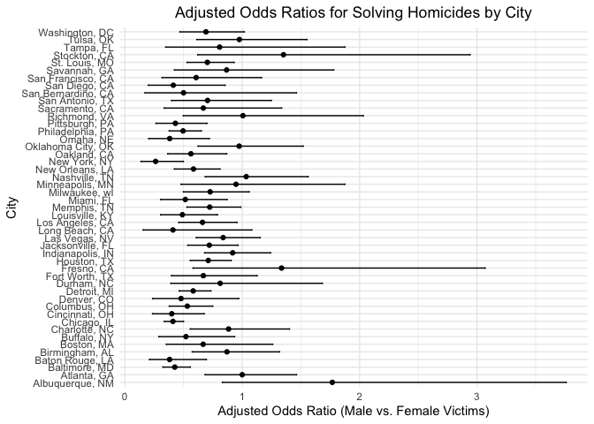

Homework6
================
Yunjia Liu
2024-12-02

## Probelm 1

1.  Load the dataset.

``` r
weather_df = 
  rnoaa::meteo_pull_monitors(
    c("USW00094728"),
    var = c("PRCP", "TMIN", "TMAX"), 
    date_min = "2017-01-01",
    date_max = "2017-12-31") %>%
  mutate(
    name = recode(id, USW00094728 = "CentralPark_NY"),
    tmin = tmin / 10,
    tmax = tmax / 10) %>%
  select(name, id, everything())
```

    ## using cached file: /Users/veronica/Library/Caches/org.R-project.R/R/rnoaa/noaa_ghcnd/USW00094728.dly

    ## date created (size, mb): 2024-09-26 10:17:42.269536 (8.651)

    ## file min/max dates: 1869-01-01 / 2024-09-30

2.  A function to calculate the r-squared and log(beta0 \* beta1)  
    First, establish a linear model between t_max and t_min. Then, we
    calculate the desired coefficient.

``` r
compute_stats = function(data) {
  model = lm(tmax ~ tmin, data = data)
  glance_model = broom::glance(model)
  tidy_model = broom::tidy(model)
  
  r_squared = glance_model$r.squared
  
  beta0 = tidy_model$estimate[tidy_model$term == "(Intercept)"]
  beta1 = tidy_model$estimate[tidy_model$term == "tmin"]
  
  log_beta0_beta1 = log(abs(beta0 * beta1))
  return(tibble(r_squared = r_squared, log_beta0_beta1 = log_beta0_beta1))
}
```

3.  A quick function to generate our bootstrap samples

``` r
boot_sample = function(df) {
  sample_frac(df, replace = TRUE)
}
```

4.  Perform bootstrap and compute r^2 and log(beta0 \* beta1)

``` r
n_boot = 5000
set.seed(123)

boot_straps =
  tibble(strap_number = 1:n_boot) |>
  mutate(
    strap_sample = map(strap_number, ~ boot_sample(weather_df)),  
    stats = map(strap_sample, compute_stats)
  )
```

5.  Extract results into a tidy format.

``` r
boot_results = 
  boot_straps |>
  unnest_wider(stats)
```

6.  Calculate the 95% confidence intervals for r^2 and log(beta0 \*
    beta1).

``` r
ci_r_squared = quantile(boot_results$r_squared, c(0.025, 0.975))
ci_log_beta0_beta1 = quantile(boot_results$log_beta0_beta1, c(0.025, 0.975))

cat("95% CI for r^2: ", ci_r_squared, "\n")
```

    ## 95% CI for r^2:  0.8945701 0.9271042

``` r
cat("95% CI for log(beta0 * beta1): ", ci_log_beta0_beta1, "\n")
```

    ## 95% CI for log(beta0 * beta1):  1.964166 2.058364

7.  Plot distributions of two estimates (r^2 and log(beta0 \* beta1))

``` r
ggplot(boot_results, aes(x = r_squared)) +
  geom_histogram(binwidth = 0.01, color = "black", fill = "blue", alpha = 0.7) +
  labs(title = "Bootstrap Distribution of r^2", x = "r^2", y = "Frequency") +
  theme(
    plot.title = element_text(hjust = 0.5)
  )
```

<!-- -->

``` r
ggplot(boot_results, aes(x = log_beta0_beta1)) +
  geom_histogram(binwidth = 0.05, color = "black", fill = "red", alpha = 0.7) +
  labs(title = "Bootstrap Distribution of log(beta0 * beta1)", x = "log(beta0 * beta1)", y = "Frequency") +
  theme(
    plot.title = element_text(hjust = 0.5)
  )
```

<!-- -->

## Problem 2

1.  Load the dataset and mutate the variables according to the
    requirement.  

Create a city_state variable and a binary variable indicating whether
the homicide is solved. Omit cities Dallas, TX; Phoenix, AZ; and Kansas
City, MO and Tulsa, AL. filter the **victim_race** to limit analysis for
whom victim_race is white or black. Take ‘Unknown’ as na and convert the
**victim_age**.

``` r
homocide_data = read_csv("./data/homicide-data.csv",,na = c("", "NA", "N/A","Unknown"))
```

    ## Rows: 52179 Columns: 12
    ## ── Column specification ────────────────────────────────────────────────────────
    ## Delimiter: ","
    ## chr (8): uid, victim_last, victim_first, victim_race, victim_sex, city, stat...
    ## dbl (4): reported_date, victim_age, lat, lon
    ## 
    ## ℹ Use `spec()` to retrieve the full column specification for this data.
    ## ℹ Specify the column types or set `show_col_types = FALSE` to quiet this message.

``` r
homocide_data =
  homocide_data |>
  mutate(
    city_state = paste(city, state, sep = ", "),
    solved = ifelse(disposition == "Closed by arrest", 1, 0),
    victim_age = as.numeric(victim_age)
  ) |>
  filter(
    !(city_state %in% c("Dallas, TX", "Phoenix, AZ", "Kansas City, MO", "Tulsa, AL")),
    victim_race %in% c("White", "Black"),
    !is.na(victim_age)
  )
```

2.  Logistic Regression for Baltimore, MD  

use the `glm` function to fit a logistic regression with resolved vs
unresolved as the outcome and victim age, sex and race as predictors.

``` r
baltimore_data =
  homocide_data |>
  filter(city_state == "Baltimore, MD")

baltimore_model = glm(
  solved ~ victim_age + victim_sex + victim_race,
  data = baltimore_data
)

saveRDS(baltimore_model, file = "model/baltimore_glm_model.rds")
```

3.  For Baltimore,MD: obtain the estimate and confidence interval of the
    adjusted odds ratio for solving homicides comparing male victims to
    female victims keeping all other variables fixed.

``` r
baltimore_loaded_model = readRDS("model/baltimore_glm_model.rds")

baltimore_or = 
  broom::tidy(baltimore_loaded_model) |>
  filter(term == "victim_sexMale") |>
  mutate(
    OR = exp(estimate),
    CI_lower = exp(estimate - 1.96 * std.error),
    CI_upper = exp(estimate + 1.96 * std.error)
  )

baltimore_or |>
  knitr::kable(digits = 3)
```

| term           | estimate | std.error | statistic | p.value |    OR | CI_lower | CI_upper |
|:---------------|---------:|----------:|----------:|--------:|------:|---------:|---------:|
| victim_sexMale |   -0.204 |     0.032 |     -6.38 |       0 | 0.816 |    0.766 |    0.868 |

Logistic Regression for All Cities. run glm for each of the cities in
your dataset, and extract the adjusted odds ratio (and CI) for solving
homicides comparing male victims to female victims.

``` r
city_models =
  homocide_data |> 
  group_by(city_state) |> 
  nest() |> 
  mutate(
    model = map(data, ~ glm(solved ~ victim_age + victim_sex + victim_race, data = ., family = binomial())),
    results = map(model, ~ broom::tidy(.) |> 
                    filter(term == "victim_sexMale") |> 
                    mutate(
                      OR = exp(estimate),  # Calculate Odds Ratio
                      CI_lower = exp(estimate - 1.96 * std.error),  # Lower CI
                      CI_upper = exp(estimate + 1.96 * std.error)   # Upper CI
                    ))
  ) |> 
  unnest(results) |> 
  select(city_state, term, OR, CI_lower, CI_upper, p.value)

city_models |> 
  knitr::kable(digits = 3)
```

| city_state         | term           |    OR | CI_lower | CI_upper | p.value |
|:-------------------|:---------------|------:|---------:|---------:|--------:|
| Albuquerque, NM    | victim_sexMale | 1.767 |    0.831 |    3.761 |   0.139 |
| Atlanta, GA        | victim_sexMale | 1.000 |    0.684 |    1.463 |   1.000 |
| Baltimore, MD      | victim_sexMale | 0.426 |    0.325 |    0.558 |   0.000 |
| Baton Rouge, LA    | victim_sexMale | 0.381 |    0.209 |    0.695 |   0.002 |
| Birmingham, AL     | victim_sexMale | 0.870 |    0.574 |    1.318 |   0.511 |
| Boston, MA         | victim_sexMale | 0.667 |    0.354 |    1.260 |   0.212 |
| Buffalo, NY        | victim_sexMale | 0.521 |    0.290 |    0.935 |   0.029 |
| Charlotte, NC      | victim_sexMale | 0.884 |    0.557 |    1.403 |   0.600 |
| Chicago, IL        | victim_sexMale | 0.410 |    0.336 |    0.501 |   0.000 |
| Cincinnati, OH     | victim_sexMale | 0.400 |    0.236 |    0.677 |   0.001 |
| Columbus, OH       | victim_sexMale | 0.532 |    0.378 |    0.750 |   0.000 |
| Denver, CO         | victim_sexMale | 0.479 |    0.236 |    0.971 |   0.041 |
| Detroit, MI        | victim_sexMale | 0.582 |    0.462 |    0.734 |   0.000 |
| Durham, NC         | victim_sexMale | 0.812 |    0.392 |    1.683 |   0.576 |
| Fort Worth, TX     | victim_sexMale | 0.669 |    0.397 |    1.127 |   0.131 |
| Fresno, CA         | victim_sexMale | 1.335 |    0.580 |    3.071 |   0.496 |
| Houston, TX        | victim_sexMale | 0.711 |    0.558 |    0.907 |   0.006 |
| Indianapolis, IN   | victim_sexMale | 0.919 |    0.679 |    1.242 |   0.582 |
| Jacksonville, FL   | victim_sexMale | 0.720 |    0.537 |    0.966 |   0.028 |
| Las Vegas, NV      | victim_sexMale | 0.837 |    0.608 |    1.154 |   0.278 |
| Long Beach, CA     | victim_sexMale | 0.410 |    0.156 |    1.082 |   0.072 |
| Los Angeles, CA    | victim_sexMale | 0.662 |    0.458 |    0.956 |   0.028 |
| Louisville, KY     | victim_sexMale | 0.491 |    0.305 |    0.790 |   0.003 |
| Memphis, TN        | victim_sexMale | 0.723 |    0.529 |    0.988 |   0.042 |
| Miami, FL          | victim_sexMale | 0.515 |    0.304 |    0.872 |   0.013 |
| Milwaukee, wI      | victim_sexMale | 0.727 |    0.499 |    1.060 |   0.098 |
| Minneapolis, MN    | victim_sexMale | 0.947 |    0.478 |    1.875 |   0.876 |
| Nashville, TN      | victim_sexMale | 1.034 |    0.685 |    1.562 |   0.873 |
| New Orleans, LA    | victim_sexMale | 0.585 |    0.422 |    0.811 |   0.001 |
| New York, NY       | victim_sexMale | 0.262 |    0.138 |    0.499 |   0.000 |
| Oakland, CA        | victim_sexMale | 0.563 |    0.365 |    0.868 |   0.009 |
| Oklahoma City, OK  | victim_sexMale | 0.974 |    0.624 |    1.520 |   0.908 |
| Omaha, NE          | victim_sexMale | 0.382 |    0.203 |    0.721 |   0.003 |
| Philadelphia, PA   | victim_sexMale | 0.496 |    0.378 |    0.652 |   0.000 |
| Pittsburgh, PA     | victim_sexMale | 0.431 |    0.265 |    0.700 |   0.001 |
| Richmond, VA       | victim_sexMale | 1.006 |    0.498 |    2.033 |   0.987 |
| San Antonio, TX    | victim_sexMale | 0.705 |    0.398 |    1.249 |   0.230 |
| Sacramento, CA     | victim_sexMale | 0.669 |    0.335 |    1.337 |   0.255 |
| Savannah, GA       | victim_sexMale | 0.867 |    0.422 |    1.780 |   0.697 |
| San Bernardino, CA | victim_sexMale | 0.500 |    0.171 |    1.462 |   0.206 |
| San Diego, CA      | victim_sexMale | 0.413 |    0.200 |    0.855 |   0.017 |
| San Francisco, CA  | victim_sexMale | 0.608 |    0.317 |    1.165 |   0.134 |
| St. Louis, MO      | victim_sexMale | 0.703 |    0.530 |    0.932 |   0.014 |
| Stockton, CA       | victim_sexMale | 1.352 |    0.621 |    2.942 |   0.447 |
| Tampa, FL          | victim_sexMale | 0.808 |    0.348 |    1.876 |   0.619 |
| Tulsa, OK          | victim_sexMale | 0.976 |    0.614 |    1.552 |   0.917 |
| Washington, DC     | victim_sexMale | 0.691 |    0.469 |    1.018 |   0.062 |

visualize the results by plotting the ORs and confidence intervals for
each city and organize cities according to estimated OR.

``` r
city_models |>
  mutate(city_state = fct_reorder(city_state, OR)) |>
  ggplot(aes(x = city_state, y = OR)) +
  geom_point() +
  geom_errorbar(aes(ymin = CI_lower, ymax = CI_upper), width = 0.2) +
  coord_flip() +
  labs(
    title = "Adjusted Odds Ratios for Solving Homicides by City",
    x = "City",
    y = "Adjusted Odds Ratio (Male vs. Female Victims)"
  ) +
  theme_minimal()
```

<!-- -->
