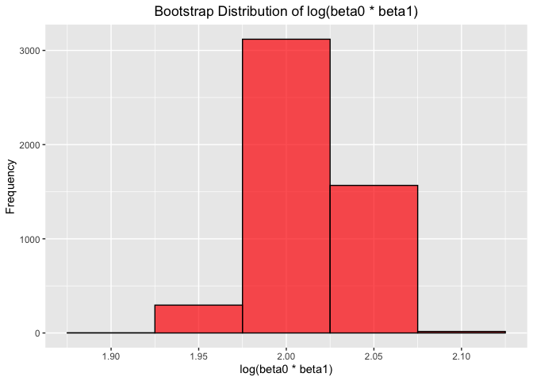

Homework6
================
Yunjia Liu
2024-12-02

## Probelm 1

1.  Load the dataset.

``` r
weather_df = 
  rnoaa::meteo_pull_monitors(
    c("USW00094728"),
    var = c("PRCP", "TMIN", "TMAX"), 
    date_min = "2017-01-01",
    date_max = "2017-12-31") %>%
  mutate(
    name = recode(id, USW00094728 = "CentralPark_NY"),
    tmin = tmin / 10,
    tmax = tmax / 10) %>%
  select(name, id, everything())
```

    ## using cached file: /Users/veronica/Library/Caches/org.R-project.R/R/rnoaa/noaa_ghcnd/USW00094728.dly

    ## date created (size, mb): 2024-09-26 10:17:42.269536 (8.651)

    ## file min/max dates: 1869-01-01 / 2024-09-30

2.  A function to calculate the r-squared and log(beta0 \* beta1)  
    First, establish a linear model between t_max and t_min. Then, we
    calculate the desired coefficient.

``` r
compute_stats = function(data) {
  model = lm(tmax ~ tmin, data = data)
  glance_model = broom::glance(model)
  tidy_model = broom::tidy(model)
  
  r_squared = glance_model$r.squared
  
  beta0 = tidy_model$estimate[tidy_model$term == "(Intercept)"]
  beta1 = tidy_model$estimate[tidy_model$term == "tmin"]
  
  log_beta0_beta1 = log(abs(beta0 * beta1))
  return(tibble(r_squared = r_squared, log_beta0_beta1 = log_beta0_beta1))
}
```

3.  A quick function to generate our bootstrap samples

``` r
boot_sample = function(df) {
  sample_frac(df, replace = TRUE)
}
```

4.  Perform bootstrap and compute r^2 and log(beta0 \* beta1)

``` r
n_boot = 5000
set.seed(123)

boot_straps =
  tibble(strap_number = 1:n_boot) |>
  mutate(
    strap_sample = map(strap_number, ~ boot_sample(weather_df)),  
    stats = map(strap_sample, compute_stats)
  )
```

5.  Extract results into a tidy format.

``` r
boot_results = 
  boot_straps |>
  unnest_wider(stats)
```

6.  Calculate the 95% confidence intervals for r^2 and log(beta0 \*
    beta1).

``` r
ci_r_squared = quantile(boot_results$r_squared, c(0.025, 0.975))
ci_log_beta0_beta1 = quantile(boot_results$log_beta0_beta1, c(0.025, 0.975))

cat("95% CI for r^2: ", ci_r_squared, "\n")
```

    ## 95% CI for r^2:  0.8945701 0.9271042

``` r
cat("95% CI for log(beta0 * beta1): ", ci_log_beta0_beta1, "\n")
```

    ## 95% CI for log(beta0 * beta1):  1.964166 2.058364

7.  Plot distributions of two estimates (r^2 and log(beta0 \* beta1))

``` r
ggplot(boot_results, aes(x = r_squared)) +
  geom_histogram(binwidth = 0.01, color = "black", fill = "blue", alpha = 0.7) +
  labs(title = "Bootstrap Distribution of r^2", x = "r^2", y = "Frequency") +
  theme(
    plot.title = element_text(hjust = 0.5)
  )
```

<!-- -->

``` r
ggplot(boot_results, aes(x = log_beta0_beta1)) +
  geom_histogram(binwidth = 0.05, color = "black", fill = "red", alpha = 0.7) +
  labs(title = "Bootstrap Distribution of log(beta0 * beta1)", x = "log(beta0 * beta1)", y = "Frequency") +
  theme(
    plot.title = element_text(hjust = 0.5)
  )
```

<!-- -->

## Problem 2

## Problem 3
